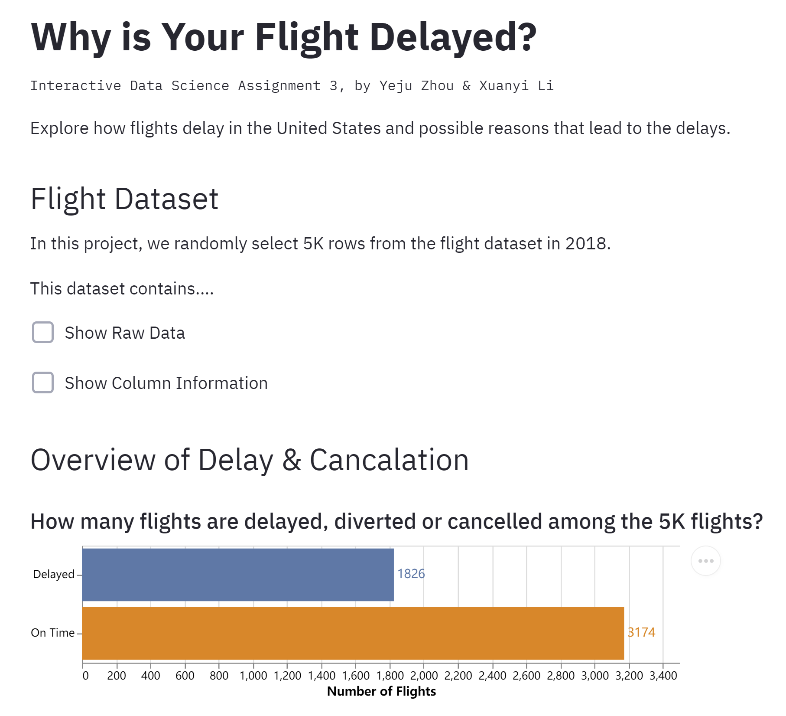
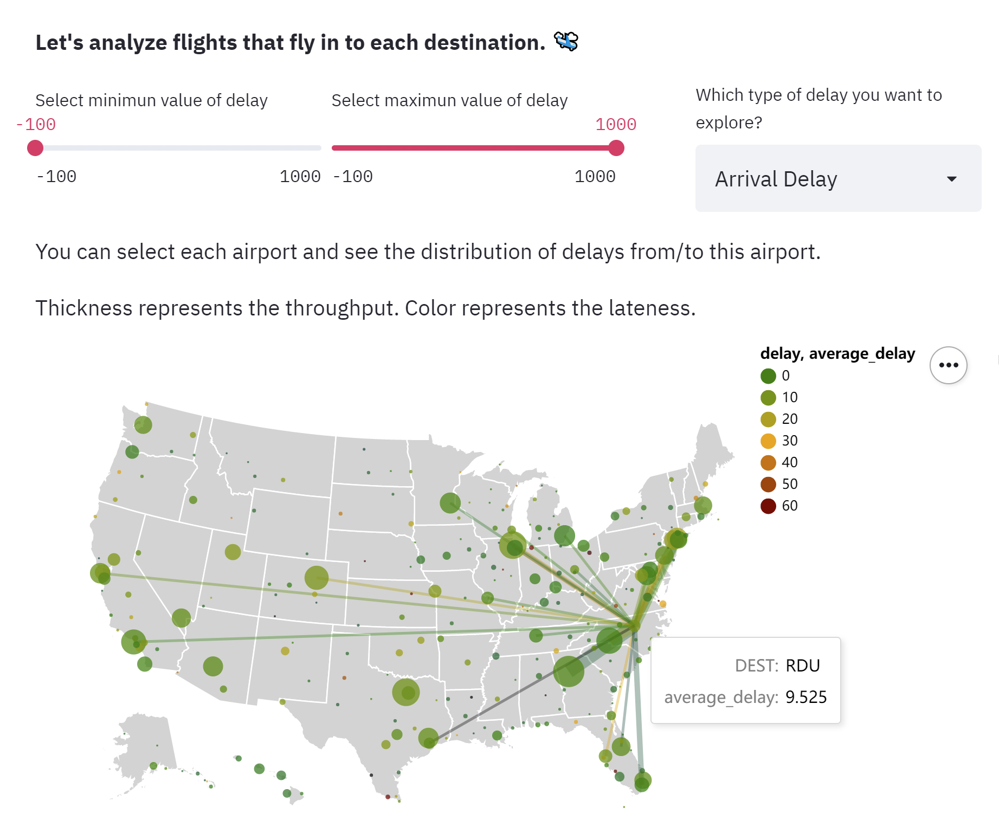
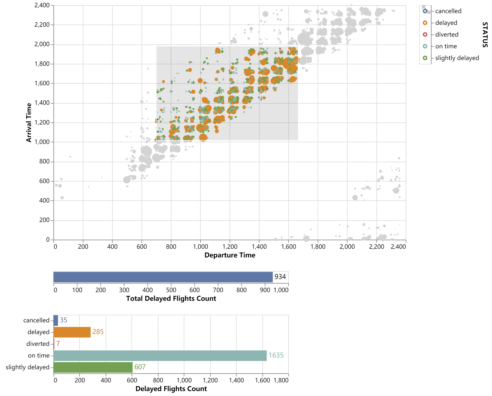
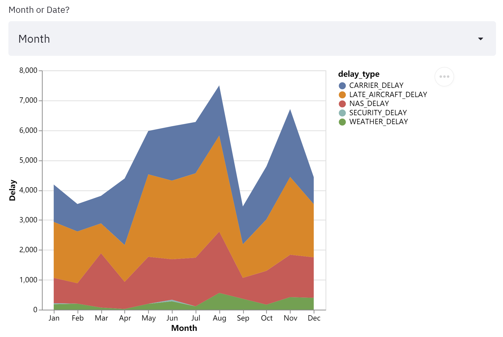

# What makes your flight delayed?

**Team members**: 

- Xuanyi Li (Andrew ID: xuanyil)

- Yeju Zhou (Andrew ID: yejuz)

  

## Overview

Flights make travel easy in the modern age. However, flights struggle with delays caused by various reasons. A lot of travelers arrive at airports a couple of minutes or hours ahead of the scheduled time only to find their flights being delayed. Understanding the causes and patterns behind these flight delays is essential to get travelers more informed, prepared and understandable when unexpected delays occur. This project aims to explore the factors related to flight delays and uncover the latent patterns between various causes of flight delays.

**Data source**: https://www.kaggle.com/yuanyuwendymu/airline-delay-and-cancellation-data-2009-2018?select=2018.csv
The dataset contains flight records in the US for the year 2018. Every record of the dataset records the route, schedule, delay time, air time and other relevant information of one flight. We select 5k records from the dataset such that the data size fits into the interactive application while staying responsive.

## Project Goals

The primary goal of this app is to answer the questions that a traveler often wants to ask when he/she waits at the airport for a delayed flight: Why the flight is delayed? How long does it delay? 

To answer these questions, we explore different types (or causes) of a flight delay, including weather delay, carrier delay, arrival delay, security delay, NAS delay and late aircraft delay. We tried to discover the correlations between those delays and various factors like the departure location, destination and flying distance by visualizing the data in an interactive and informative manner. It turns out that certain types of delays tend to be more common than the others while some delays just occur frequently in the busiest metropolitan areas. 

Generally, the application provides clear, interactive and flexible visualizations of the dataset to explore patterns and insights that can better inform travelers. 

## Design

#### Data Cleansing & Transformation

Before getting into visualizations, we look into each feature in the dataset and clean out irrelevant information. Fortunately, the dataset selected appears to have a consistent structure and correct information. The only issue is missing values. A lot of entries in the delay time of different delay types are 'nan' time values. We examine the records and find out that as not all flights are delayed and those delayed flights may correspond to different delay types, some delay types are not applicable for certain flights. Therefore, we replace the missing values with '0' to indicate that the flight is not delayed by such type that has a '0' time value.

We also add a 'STATUS' column to the dataset to indicate the delay status of the flight for our convenience. If a flight is on-time, then its status is 'on time'. If a flight is delayed for not more than 30 minutes, it is 'slightly delayed'. If a flight is delayed for 30 minutes or more, it is 'delayed'. There are also 'diverted' and 'canceled' flights.

#### Visual Encodings

##### Bar Chart

The first couple of bar charts show the ratio of delayed and on-time flights, and the time distribution of different delay types. These visualizations aim to give people a basic view of flight delay from a statistics perspective. Bar charts give people the exact values while maintaining a good sense of ratio.

##### Map Plot

Geographical information is very important for flights. Flights can be affected by the cities, airports from which they departure and to which they arrive. Given hundreds of flight routes across cities, airports and states in the US, we decide to draw a map plot with circles to visualize the flight routes and airport locations along with their delay statistics. To enhance clarity and flexibility, we do not always show the messy flight routes, instead, the routes connected to a city and relevant statistics are revealed when pointing the mouse to the city.

##### Point Plot

Another feature that distinguishes a flight is the schedule. We plot a point plot with the departure time as the x-axis and the arrival time as the y-axis. Every point or circle on the plot indicates exactly one flight. The color of the points indicates the delay status of the flight. To make the plot more informative, we add a selection tool that allows the user to select a time interval. After selection, the points outside of the interval will be faded. And the two bar charts below counts the flights of each delay status for flights within the selected time interval, allowing the user to find out the time interval during which the flights are more likely to be delayed. The user can also select one particular delay status to view by clicking the color dot on the legend.

##### Mixed Plot with Axis Selection

Multiple visualizations in the app enable axis selection, allowing the user to explore the dataset with flexibility. Although we have already presented the most eye-catching patterns and insights, there are still correlations that might be interesting for the user. We give users the flexibility to select features and discover on their own. These plots are comparatively simple, however, we hardcode to ensure different data types would not mess up with the encodings.

## Development

#### Dataset Selection

It took a while for us to select an appropriate dataset that both fits the project and our interest. We looked at a lot of other datasets  like the weather data, banking data, Yelp open dataset before deciding on this one. This may took each of our team members for 1 hour.

#### Data Exploration

We did not begin visual designing right after deciding on the dataset. We each took some time to explore the dataset on our own by looking at the pandas data frame and drawing some simple distributions. We also had to figure out which features might be useful and what transformations are needed to transform the features into an accessible format. For example, transforming the delay time into categorical delay status. This procedure took each member for approximately 2 hours. 

#### Learn Streamlit & Altair

As it is the first time for both of us to use Streamlit and Altair, we spent time reading through the examples and documentation of these packages. This took each of us for around 2 hours.

#### Design and Implementation

This part took most of the time. Xuanyi designed and implemented the interactive map plots. Yeju designed and implemented the interactive point plot and bar plot. Both team members designed and implemented their own visualizations of delay distribution, delay distribution of each delay type and the relationship between certain delay types and features like departure time, month, flying distance, etc. And the better ones are selected from these overlapping works after discussion. This design and implementation process took each of us for around 12 hours.

#### Design Review and Writeup

We went over the app to add titles, subtitles and instructions to make the app easier to follow. We adjusted the order of visualizations and design details to make the exploratory process smoother. In the end, we wrote the writeup together. This process took each of us for about 4 hours. 

